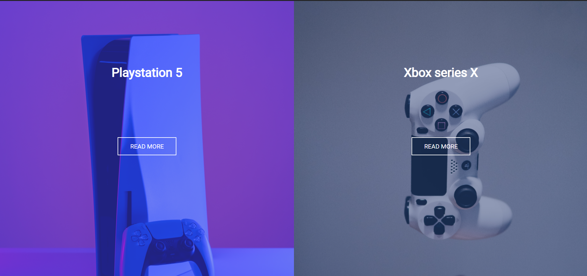

# Responsive Split Screen Landing
This is a Simple Landing Page created using HTML, CSS (Flexbox) 

## Developed By 
> Nishkarsh Dubb

## Screenshots 📷

## Live Demo 

 [https://nishkarsh01.github.io/responsive-split-screen-landing-page/](https://nishkarsh01.github.io/responsive-split-screen-landing-page/)

## Developed Using 💻

+ [Html](https://developer.mozilla.org/en-US/docs/Web/HTML)
+ [Css](https://developer.mozilla.org/en-US/docs/Web/CSS)

## Installation or Getting Started

Run the following command in the terminal:

	git clone https://github.com/Nishkarsh01/responsive-split-screen-landing-page.git
or download the zip file from github.
    

## Usage
After extracting the files,

    cd responsive-split-screen-landing-page/
    open index.html

## Collaborate
To collaborate, reach us on [nishdubb11@gmail.com]()

## Further help/Reference

+ [MDN Web Docs](https://developer.mozilla.org/en-US/)
+ [w3schools.com](https://www.w3schools.com/)
    

